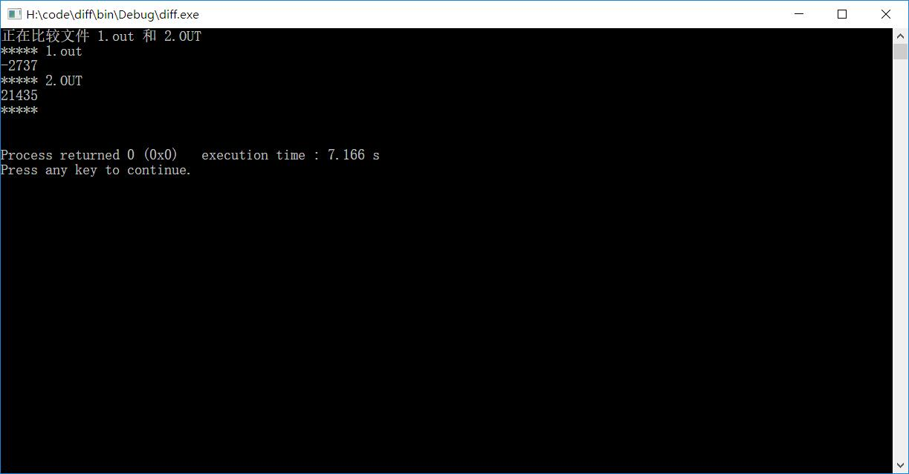

# acm_codeCompare
ACM对拍器（for Windows）

流程：
1. 编写dy和compare文件夹的main.cpp，为要对拍的两个程序
2. 编写gen文件夹的main.cpp, 为对拍数据产生器
3. 修改diff文件夹下的main.cpp, 只需修改相关文件路径即可
4. 编译并运行diff文件夹下的main.cpp，g++ -std=c++11 main.cpp -o main.exe, main.exe执行

